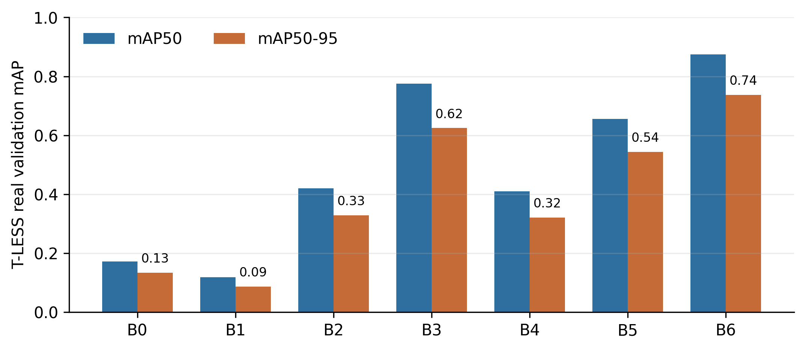
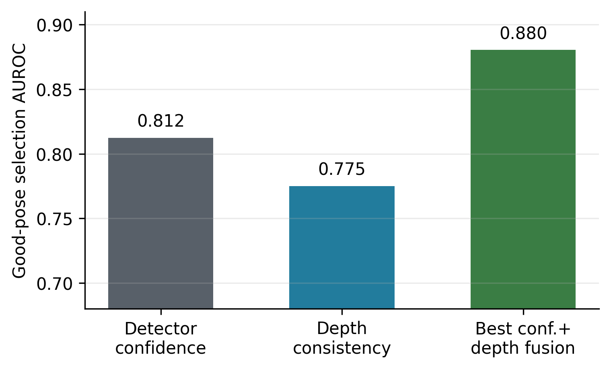
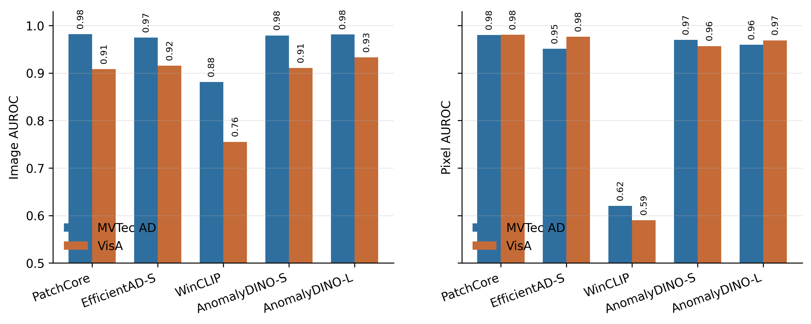
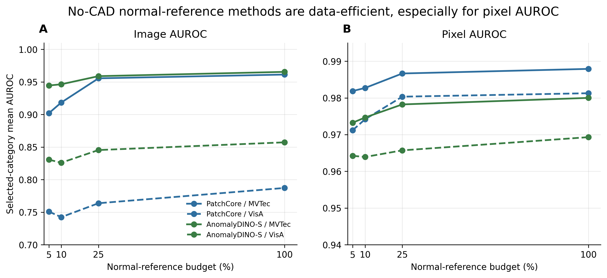

<div align="center">

# Prior Availability in Industrial Visual Sim-to-Real

### A review of CAD-guided, boundary-prior, and CAD-unavailable industrial vision regimes

Chenxi Tao and Seung-Kyum Choi  
George W. Woodruff School of Mechanical Engineering, Georgia Institute of Technology

[](https://arxiv.org/abs/2605.30581)
[](https://arxiv.org/pdf/2605.30581)
[](https://doi.org/10.48550/arXiv.2605.30581)
[](#repository-scope)

**Paper:** *Prior Availability in Industrial Visual Sim-to-Real: A Review of CAD-Guided and CAD-Unavailable Regimes*


</div>

## At a Glance

Industrial visual sim-to-real is often treated as a synthetic-to-real image-transfer problem. This review instead asks a deployment question:

> **What prior is available to ground the industrial vision decision?**

The paper uses CAD availability as the main organizing axis. CAD-available methods can render, align, and verify against geometry. CAD-unavailable inspection replaces explicit geometry with normal-reference appearance, feature distributions, residuals, synthetic anomaly assumptions, foundation features, or vision-language priors. Boundary-prior methods sit between those regimes when approximate models, templates, reference views, prompts, or semantic correspondences preserve only part of the CAD role.

## Repository Scope

This repository is a lightweight project and reproducibility artifact for the review. It is intentionally not a manuscript-source mirror, dataset mirror, model-zoo release, or full experiment archive.

| Included | Not included |
| --- | --- |
| Reproduction scripts for the empirical anchors | Overleaf manuscript source |
| Lightweight CSV/JSON result summaries | Raw benchmark datasets, masks, depth maps, or CAD archives |
| Aggregate figures that do not redistribute benchmark imagery | Full training runs, checkpoints, cached features, or local environments |
| Dataset download and layout notes | Qualitative contact sheets or overlays containing benchmark images |

## Empirical Anchors

The empirical component supports the review argument. It is not intended as a single cross-task leaderboard.

| Anchor | Prior regime | What it supports | Artifacts |
| --- | --- | --- | --- |
| **T-LESS/BOP** | CAD-guided | CAD-as-renderer transfer, pose, mask/depth verification | `experiments/`, `results/cad_available/` |
| **MVTec AD** | CAD-unavailable | Normal-reference and feature-based industrial anomaly inspection | `experiments/`, `results/cad_unavailable/` |
| **VisA** | CAD-unavailable | Anomaly inspection under more varied object and defect categories | `experiments/`, `results/cad_unavailable/` |

## Project Layout

```text
experiments/        Scripts used to prepare, run, evaluate, and summarize the empirical anchors.
results/            Lightweight CSV/JSON summaries and selected training diagnostics.
figures/paper/      Conceptual figures used by the manuscript.
figures/aggregate/  Compact aggregate plots for quick inspection.
data/               Dataset download, license, and local-layout notes.
reproduce/          Reproduction notes for the empirical anchors.
```

## Figure Preview

<table>
  <tr>
    <td align="center" width="50%">
      <b>Prior-availability framing</b><br>
      
    </td>
    <td align="center" width="50%">
      <b>Mechanism matrix</b><br>
      
    </td>
  </tr>
  <tr>
    <td align="center" width="50%">
      <b>CAD-as-renderer transfer</b><br>
      
    </td>
    <td align="center" width="50%">
      <b>CAD-at-test-time verification</b><br>
      
    </td>
  </tr>
  <tr>
    <td align="center" width="50%">
      <b>CAD-unavailable anomaly anchors</b><br>
      
    </td>
    <td align="center" width="50%">
      <b>Normal-reference budget</b><br>
      
    </td>
  </tr>
</table>

## How to Use

1. Download the external datasets listed in [`data/README.md`](data/README.md) from their official sources.
2. Match the expected local layout, or update paths in the relevant scripts under [`experiments/`](experiments/).
3. Inspect the included result summaries under [`results/`](results/).
4. Use [`reproduce/README.md`](reproduce/README.md) as the entry point for reproducing or extending the empirical anchors.

## Results Included

The included result files cover four review-support blocks:

| Block | Summary |
| --- | --- |
| CAD-as-renderer transfer | T-LESS/BOP YOLO detector variants under synthetic-only, domain-randomized, and small-real-calibrated settings |
| CAD at test time | Mask, ROI, and depth-consistency diagnostics for geometry-based verification |
| CAD-unavailable anchors | PatchCore, EfficientAD, WinCLIP, AnomalyDINO, and related anomaly-detection summaries on MVTec AD and VisA |
| Normal-reference budget | Reduced-normal-reference diagnostics for CAD-unavailable inspection |

## Keywords

industrial visual sim-to-real; prior availability; CAD-guided vision; CAD-unavailable inspection; boundary priors; 6D object pose estimation; industrial anomaly detection; render-and-compare verification; domain gap

## Citation

```bibtex
@article{tao2026prioravailability,
  title={Prior Availability in Industrial Visual Sim-to-Real: A Review of CAD-Guided and CAD-Unavailable Regimes},
  author={Tao, Chenxi and Choi, Seung-Kyum},
  journal={arXiv preprint arXiv:2605.30581},
  doi={10.48550/arXiv.2605.30581},
  eprint={2605.30581},
  archivePrefix={arXiv},
  primaryClass={cs.CV},
  year={2026}
}
```

## Contact

Chenxi Tao: ctao40@gatech.edu  
Seung-Kyum Choi: schoi@me.gatech.edu
